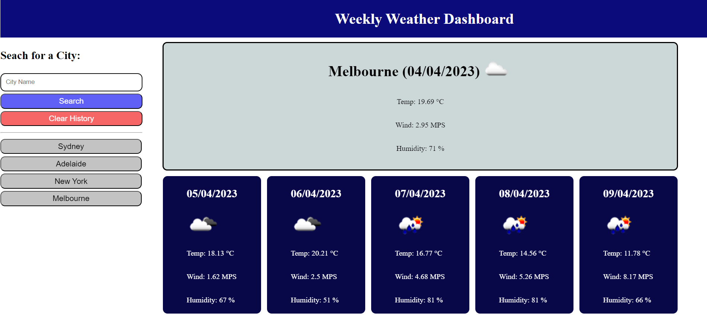

# Weekly Weather

## Description

I wanted to create a website that allows me to search for the current and next 5 day weather forecast. I also wanted the website to save my search history and be dynamic with the saved buttons.

Heres the link to try out: https://zeinahares.github.io/Weekly-Weather/

## Installation

N/A

## Usage

When you open the website you are presented with a weather dashboard showing the forecast of Sydney with a search input to search for other cities.
When you search for a city, then you are presented with current and future conditions for that city. That city is also added to the search history and printed on the page.
When you view the current weather conditions for that city, then you are presented with the city name, the date, an icon representation of weather conditions, the temperature, the humidity, and the wind speed.
If you click on a city in the search history then you are again presented with current and future conditions for that city

## License

MIT License

Copyright (c) 2023 zeinahares

Permission is hereby granted, free of charge, to any person obtaining a copy of this software and associated documentation files (the "Software"), to deal in the Software without restriction, including without limitation the rights to use, copy, modify, merge, publish, distribute, sublicense, and/or sell copies of the Software, and to permit persons to whom the Software is furnished to do so, subject to the following conditions:

The above copyright notice and this permission notice shall be included in all copies or substantial portions of the Software.

THE SOFTWARE IS PROVIDED "AS IS", WITHOUT WARRANTY OF ANY KIND, EXPRESS OR IMPLIED, INCLUDING BUT NOT LIMITED TO THE WARRANTIES OF MERCHANTABILITY, FITNESS FOR A PARTICULAR PURPOSE AND NONINFRINGEMENT. IN NO EVENT SHALL THE AUTHORS OR COPYRIGHT HOLDERS BE LIABLE FOR ANY CLAIM, DAMAGES OR OTHER LIABILITY, WHETHER IN AN ACTION OF CONTRACT, TORT OR OTHERWISE, ARISING FROM, OUT OF OR IN CONNECTION WITH THE SOFTWARE OR THE USE OR OTHER DEALINGS IN THE SOFTWARE.